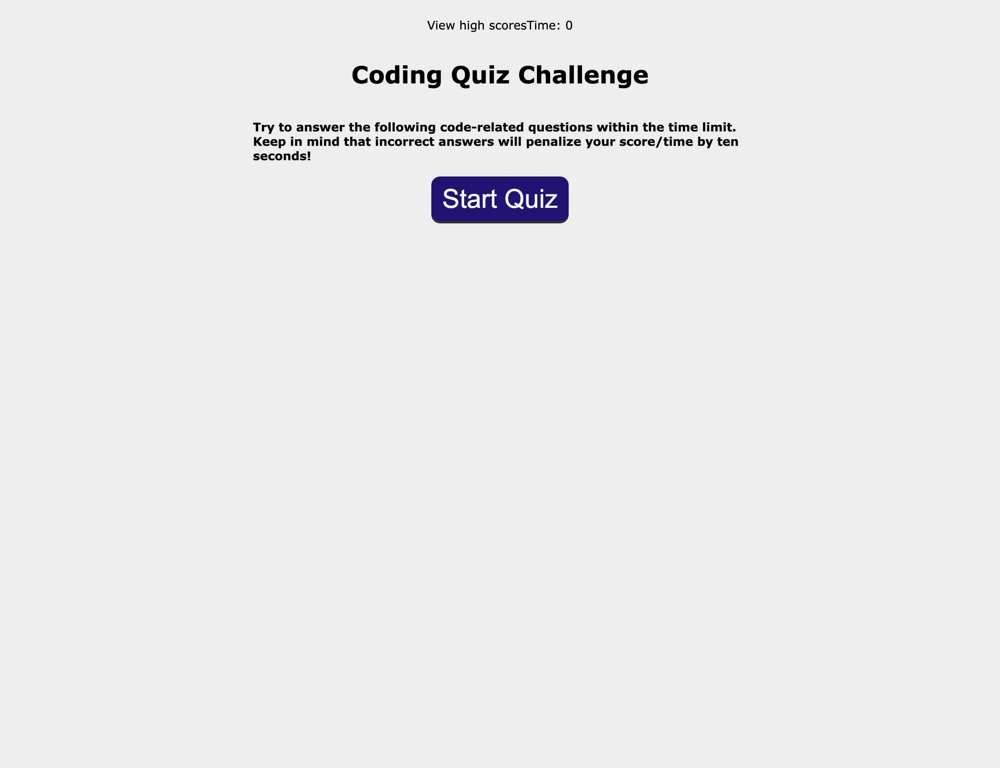

# code-quiz
<h2>Link To Website</h2>

<a href= "https://brian-000.github.io/code-quiz/">https://brian-000.github.io/code-quiz/</a>

<h2>Description</h2>

 This coding quiz is to test your knowledge in html, css, and javascript

<h2>Screenshot of Website</h2>

